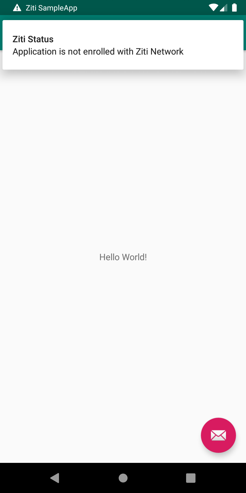
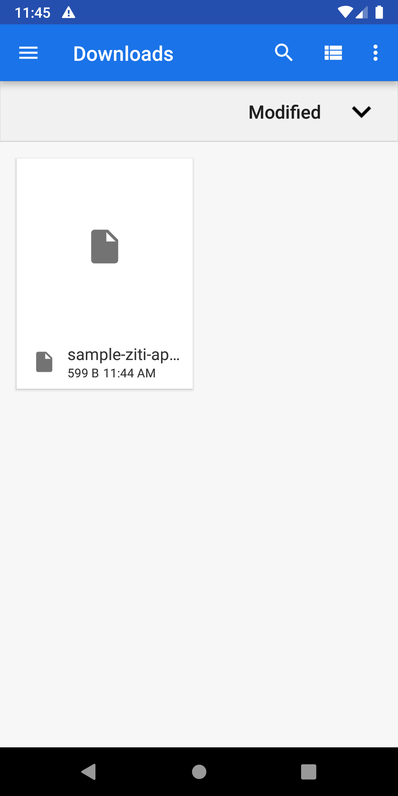
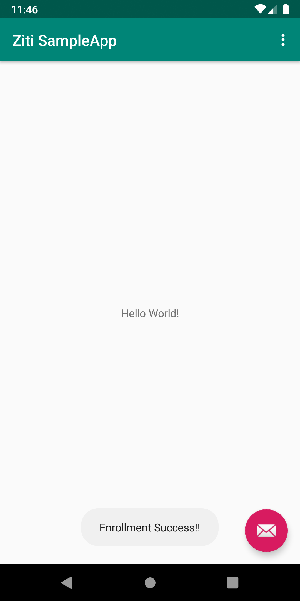

# Ziti Android Quickstart

This is a simple app that demonstrates the use of Ziti SDK for Android (and Java).

## Prerequisites
* Android studio or other Android IDE
* Android simulator or device to run the app

## Running the app

* Create Ziti Network following the [guide](https://openziti.github.io/ziti/quickstarts/networks-overview.html)
* Create weather service that is used by this app:
  ```
  name = ziti-weather-service
  hostname = weather.ziti.netfoundry.io
  port = 80
  
  endpoint host = wttr.in
  endpoint port = 80
  endpoint protocol = tcp
  ```
* Create an identity for the device running this. You'll need one identity per device.
  You will need to configure access to the service for your new identity.
  Download enrollment JWT and copy it to the device.
* Once the app starts it will show notification to let user know that the app has not been enrolled
  
* Tapping the notification allows you to select enrollent token
  
*  If enrollment is successful it shows shows notification on the screen
  
* After that the app can be used -- pushing the message button should load current weather 
  for Charlotte on the screen
